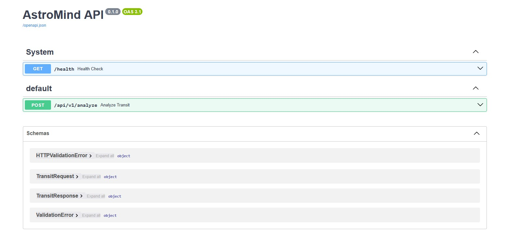
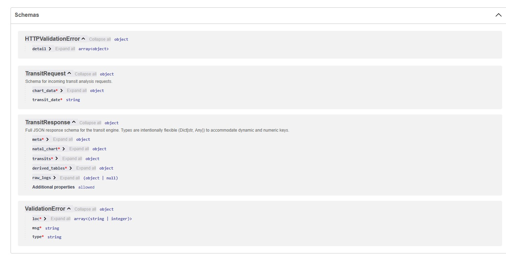

#  ASTROPARAMITA JYOTISH Transit Engine API


**Astroparamita JYOTISH API** is a professional-grade microservice designed for Vedic astrology calculations and real-time transit analysis. Built with **Clean Architecture** principles, it leverages the precision of the Swiss Ephemeris to provide detailed insights into planetary positions, house scores, and astrological periods.

---

##  Key Features

-  **Precision Calculations**: Powered by `pyswisseph` (Swiss Ephemeris) for high astronomical accuracy.
-  **Deep Transit Analysis**: Automated scoring for houses, planet aspects, Sade-Sati detection, and Vimshottari Dasha periods.
-  **High Performance**: Optimized core logic with an average request processing time of **< 20ms**.
-  **Production Ready**: Fully containerized with Docker, featuring centralized logging and health monitoring.
-  **Robust Validation**: Strict data schema enforcement using Pydantic v2.


---
## Interactive API Documentation

## API Preview

<details>
  <summary>Click to view Swagger UI Screenshots</summary>

  ### API Endpoints Overview
  

  ### Transit Analysis Sample (JSON Response)
  

  ### Data Schemas (Pydantic Models)
  
</details>

To quickly test the API in Swagger UI, you can use this sample payload:
```json
{
  "chart_data": {
    "name": "Автор",
    "date": "1988-02-02",
    "time": "02:02",
    "city": "Москва",
    "latitude": 55.7558,
    "longitude": 37.6173,
    "timezone": "Europe/Moscow",
    "utc_offset": 3.0,
    "julian_day": 2447193.45972,
    "lagna": 198.97,
    "sign": "Весы",
    "planets": {
      "Лагна": {
        "degree": "18°58'5''",
        "sign": "Весы",
        "house": 1,
        "nakshatra": "Свати",
        "pada": 4,
        "nakshatra_lord": "Раху",
        "retrograde": false,
        "display_name": "Лагна"
      },
      "Солнце": {
        "degree": "18°37'6''",
        "sign": "Козерог",
        "house": 4,
        "nakshatra": "Шравана",
        "pada": 3,
        "nakshatra_lord": "Луна",
        "retrograde": false,
        "display_name": "Солнце"
      },
      "Луна": {
        "degree": "8°45'15''",
        "sign": "Рак",
        "house": 10,
        "nakshatra": "Пушья",
        "pada": 2,
        "nakshatra_lord": "Сатурн",
        "retrograde": false,
        "display_name": "Луна",
        "longitude": 8.754166666666666
      },
      "Марс": {
        "degree": "22°33'1''",
        "sign": "Скорпион",
        "house": 2,
        "nakshatra": "Джйештха",
        "pada": 2,
        "nakshatra_lord": "Меркурий",
        "retrograde": false,
        "display_name": "Марс"
      },
      "Меркурий": {
        "degree": "4°22'1''",
        "sign": "Водолей",
        "house": 5,
        "nakshatra": "Дхаништха",
        "pada": 4,
        "nakshatra_lord": "Марс",
        "retrograde": false,
        "display_name": "Меркурий"
      },
      "Юпитер": {
        "degree": "29°51'56''",
        "sign": "Рыбы",
        "house": 6,
        "nakshatra": "Ревати",
        "pada": 4,
        "nakshatra_lord": "Меркурий",
        "retrograde": false,
        "display_name": "Юпитер"
      },
      "Венера": {
        "degree": "27°15'17''",
        "sign": "Водолей",
        "house": 5,
        "nakshatra": "Пурва-Бхадрапада",
        "pada": 3,
        "nakshatra_lord": "Юпитер",
        "retrograde": false,
        "display_name": "Венера"
      },
      "Сатурн": {
        "degree": "5°13'12''",
        "sign": "Стрелец",
        "house": 3,
        "nakshatra": "Мула",
        "pada": 2,
        "nakshatra_lord": "Кету",
        "retrograde": false,
        "display_name": "Сатурн"
      },
      "Раху": {
        "degree": "1°47'7''",
        "sign": "Рыбы",
        "house": 6,
        "nakshatra": "Пурва-Бхадрапада",
        "pada": 4,
        "nakshatra_lord": "Юпитер",
        "retrograde": true,
        "display_name": "Раху R"
      },
      "Кету": {
        "degree": "1°47'7''",
        "sign": "Дева",
        "house": 12,
        "nakshatra": "Уттара-Пхалгуни",
        "pada": 2,
        "nakshatra_lord": "Солнце",
        "retrograde": true,
        "display_name": "Кету R"
      }
    }
  },
  "transit_date": "2025-12-29"
}
```

### Production (Live Server)
The API is deployed and accessible online:
- **Swagger UI**: [https://jyotishapi-production.up.railway.app/docs](https://jyotishapi-production.up.railway.app/docs)
- **ReDoc**: [https://jyotishapi-production.up.railway.app/redoc](https://jyotishapi-production.up.railway.app/redoc)
 **Health Status**: `Active`
- 
###  Local Development
If you are running the service locally (via Docker or Python):
- **Swagger UI**: [http://localhost:8000/docs](http://localhost:8000/docs)
- **ReDoc**: [http://localhost:8000/redoc](http://localhost:8000/redoc)
---

##  Reliability & Production Standards

- **Error Handling**: Graceful error management with clear HTTP exception responses and detailed internal traceback logging.
- **Logging Strategy**: Structured logging implemented via `FileHandler` and `StreamHandler` for both persistence and real-time container monitoring.
- **Continuous Integration**: Automated testing pipeline via GitHub Actions ensures every commit passes unit and integration benchmarks.
- **Environment Management**: Secure configuration handling using `.env` templates and Pydantic settings.
---


##  Tech Stack

- **Framework**: [FastAPI](https://fastapi.tiangolo.com/) (Asynchronous Python Web Framework)
- **Validation**: [Pydantic v2](https://docs.pydantic.dev/)
- **Astronomy Core**: [Swiss Ephemeris](https://github.com/astrorama/pyswisseph)
- **DevOps**: Docker, GitHub Actions (CI), Makefile
- **Testing**: Pytest (Unit & Integration)

---


## System Architecture & Ecosystem

This API is designed as the **High-Precision Analytical Core** of the Astroparamita ecosystem. It follows a decoupled, layered architecture to separate astronomical math from web-service logic.

### Ecosystem Integration

System Architecture


### This service acts as the bridge between raw astronomical data and intelligent interpretation:
1. **Request**: The AI Consultant API (acting as the system orchestrator) sends a request for precise astronomical calculations
2. **Processing**: This API performs Swiss Ephemeris-based calculations, house scoring, and period analysis.
3. **Delivery**: Results are returned in a strictly typed JSON format to the AI Consultant, which then synthesizes this data with RAG-knowledge for the Telegram Bot.

### Related Repositories:
*  [**Astroparamita Bot**](https://github.com/PPushkarev/astroparamitabot) — Telegram Client Interface.
*  [**JyotishAI Consultant**](https://github.com/PPushkarev/joytishai) — AI Orchestrator & Interpretation Engine.


### Internal Modular Structure

The codebase is strictly organized to ensure maintainability:

* **API & Validation Layer**:
    * `app/api.py`: Handles asynchronous request routing and HTTP middleware.
    * `app/schemas.py`: Defines **Pydantic v2** models for strict data contracts (ensures the AI always receives valid data).
* **Orchestration Layer**:
    * `app/transit_service.py`: Coordinates the logic between the API requests and the calculation engine.
* **The Engine (Framework-Independent)**:
    * `core.py`: Professional interface for the **Swiss Ephemeris** C-library.
    * `core_files/`: Contains the pure Vedic business logic (Dashas, Ashtakoota, etc.). This layer is **portable** and can be used in CLI or other frameworks.
* **Quality Assurance**:
    * `tests/`: A comprehensive suite of unit and integration tests to ensure calculation accuracy.

---

##  Quick Start

### Prerequisites
- Python 3.11+ or Docker installed.

### Using Docker (Recommended)
Spin up the service in seconds:
```bash
make docker-build
make docker-run
```

---
### Environment Variables
1. Rename `.env.example` to `.env`.
2. Configure your local `PORT` and `PYTHONPATH`.
3. For production, set these variables in your hosting provider (Railway/AWS).